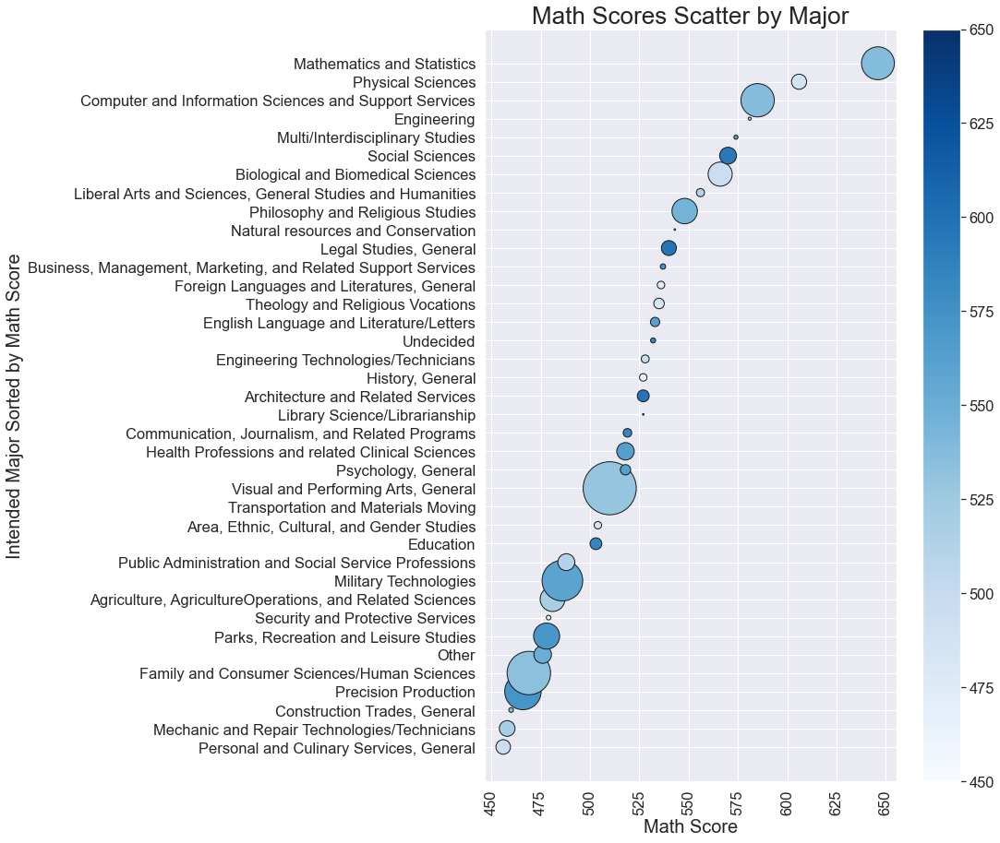
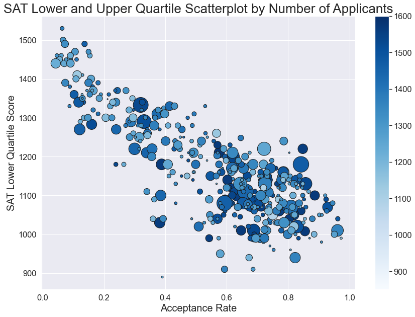

## Introduction

 As a part-time tutor who also dabbles in data science, I have several students who are struggling to understand what the future holds for them and how standardized tests fit into their life path. They are feeling overwhelmed with all the data around "acceptable test scores" for various schools and majors. They want a good education, but need some help narrowing down the choices for majors and schools, based on their target (or expected) SAT score range. The purpose of this project is to help explore existing score data and how it relates to various majors and colleges for college-bound students.

## How to Run:

This is a simple jupyter notebook that contains various steps to clean SAT, ACT, College, and College Major data that produces handy visualizations as well as cleaned dataframes that can be used to customize your own visualization. Simply run the notebook with your favorite .ipynb tool and you should be able to produce the results shown in the images folder. 

## Discussion and Next Steps

Based on all this data, we can conclude that being able to look at the subscores and SAT Quartiles of scores that correspond to certain majors or colleges is a useful way to approach becoming informed about the process. By sorting our score values we were able to understand which were the majors that correspond to which of the top scores. For example, it helps to know that if I want to pursue an engineering degree, I will probably want to make sure to have a high math score, but also a high reading and writing score (as opposed to the conventional logic of just needing math). Future projects could include building a machine learning recommender system that allows one to take all of these colleges with a corresponding score and recommending automatically the best college/major for a given student's score. 

## Data Sources
There are 10 datasets included in the [`data`](./data/) folder for this project. 

* [`act_2017.csv`](./data/act_2017.csv): 2017 ACT Scores by State
* [`act_2018.csv`](./data/act_2018.csv): 2018 ACT Scores by State
* [`act_2019.csv`](./data/act_2019.csv): 2019 ACT Scores by State
* [`act_2019_ca.csv`](./data/act_2019_ca.csv): 2019 ACT Scores in California by School
* [`sat_2017.csv`](./data/sat_2017.csv): 2017 SAT Scores by State
* [`sat_2018.csv`](./data/sat_2018.csv): 2018 SAT Scores by State
* [`sat_2019.csv`](./data/sat_2019.csv): 2019 SAT Scores by State
* [`sat_2019_by_intended_college_major.csv`](./data/sat_2019_by_intended_college_major.csv): 2019 SAT Scores by Intended College Major
* [`sat_2019_ca.csv`](./data/sat_2019_ca.csv): 2019 SAT Scores in California by School
* [`sat_act_by_college.csv`](./data/sat_act_by_college.csv): Ranges of Accepted ACT & SAT Student Scores by Colleges

### Data Dictionary
|Feature|Type|Dataset|Description|
|---|---|---|---|
|intended_major|object|2019 SAT Scores by Intended College Major|The name of various majors and fields of interest for prospective college-bound applicants.| 
|test_takers_per_major|float|2019 SAT Scores by Intended College Major|The number of test takers who are interested in major| 
|percent_of_total_decimal|float|2019 SAT Scores by Intended College Major|Percent of total expressed as a decimal| 
|total_accepted|int|2019 SAT Scores by Intended College Major|Total number of students accepted for the intended major| 
|reading_writing_sat_score|int|2019 SAT Scores by Intended College Major|Score for the reading and writing SAT section| 
|math_sat_score|int|2019 SAT Scores by Intended College Major|Score for the reading and writing Math section| 

|Feature|Type|Dataset|Description|
|---|---|---|---|
|school_name|obj|Ranges of Accepted ACT & SAT Student Scores by Colleges|Name of the University or College |
|number_applicants|int|Ranges of Accepted ACT & SAT Student Scores by Colleges|Number of applicants for this college|
|acceptance_rate|float64|Ranges of Accepted ACT & SAT Student Scores by Colleges|Acceptance rate as a decimal|
|sat_quartile_range|object|Ranges of Accepted ACT & SAT Student Scores by Colleges|SAT Quartile range (as a string)|
|act_quartile_range|object|Ranges of Accepted ACT & SAT Student Scores by Colleges|ACT Quartile Range (as a string|
|sat_lower_quartile|float64|Ranges of Accepted ACT & SAT Student Scores by Colleges|SAT Score marking the lower quartile for the given college or university|
|sat_upper_quartile|float64|Ranges of Accepted ACT & SAT Student Scores by Colleges|SAT Score marking the upper quartile for the given college or university|

